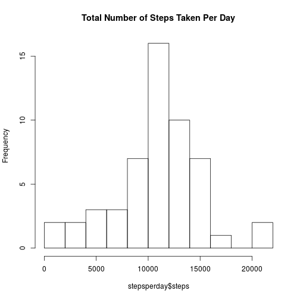
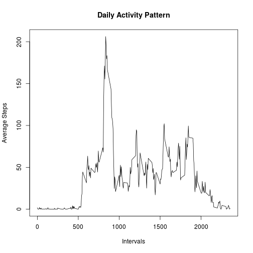
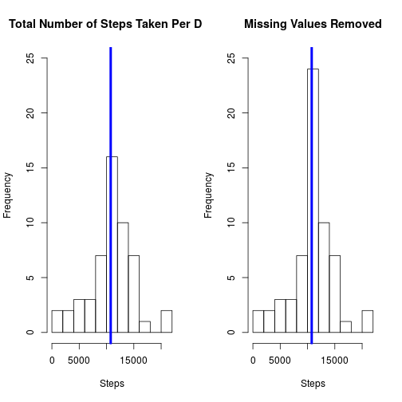
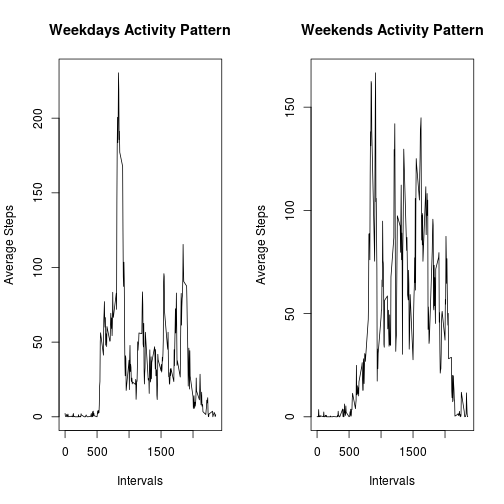

##Loading and Preprocessing Data

```r
file<-"Data/activity.csv"
data<-read.csv(file, stringsAsFactors=FALSE)
str(data)
```

```
## 'data.frame':	17568 obs. of  3 variables:
##  $ steps   : int  NA NA NA NA NA NA NA NA NA NA ...
##  $ date    : chr  "2012-10-01" "2012-10-01" "2012-10-01" "2012-10-01" ...
##  $ interval: int  0 5 10 15 20 25 30 35 40 45 ...
```

The data file has some missing values and also the formatting of the data column is not proper. To correct the data column:


```r
data$date<-as.Date(data$date)
```

##What is mean total number of steps taken per day?
forming stepsperday data frame that incudes the date and sum of steps taken that day:


```r
stepsperday<-aggregate(steps ~ date, data, sum)
```

Generating the histogram:


```r
hist(stepsperday$steps, 10, main="Total Number of Steps Taken Per Day")
```



Calculating the mean and median:


```r
mean(stepsperday$steps)
```

```
## [1] 10766.19
```

```r
median(stepsperday$steps)
```

```
## [1] 10765
```
The mean and median steps per day are 10766.19 and 10765 steps, respectively.

##What is the average daily activity pattern?


```r
actpattern<-aggregate(steps ~ interval, data, mean)
```

Plotting the Dailiy Activity Pattern

```r
plot(y=actpattern$steps, x=actpattern$interval, type="l", xlab="Intervals", ylab="Average Steps", main="Daily Activity Pattern")
```


Period with maximum number of steps:


```r
actpattern[actpattern$steps==max(actpattern$steps),1]
```

```
## [1] 835
```

```r
actpattern[actpattern$steps==max(actpattern$steps),2]
```

```
## [1] 206.1698
```
Maximum number of steps are taken in period 835 with 206.2 average steps.

##Inputing missing values

Number of missing values:

```r
sum(is.na(data$steps))
```

```
## [1] 2304
```
There are 2304 missing values.

Replacing missing values with the mean values for corresponding intervals from actpattern data frame.

```r
data_fixed<-data
for (i in 1:nrow(data_fixed)){
  if (is.na(data_fixed[i,1])){
    data_fixed[i,1]<-actpattern[which(actpattern$interval==data_fixed[i,3]),2]
  }
}
```
Now the number of missing values is 0:

```r
sum(is.na(data_fixed$steps))
```

```
## [1] 0
```
Plotting data and data_fixed side by side to see how removing missing values effected the distribution.


```r
par(mfrow=c(1,2))
stepsperday_fixed<-aggregate(steps ~ date, data_fixed, sum)
hist(stepsperday$steps, 10, main="Total Number of Steps Taken Per Day", xlab="Steps", ylim=c(0,25))
abline(v=median(stepsperday$steps),col=4, lwd=4)
hist(stepsperday_fixed$steps, 10, main="Missing Values Removed", xlab="Steps", ylim=c(0,25))
abline(v=median(stepsperday_fixed$steps),col=4, lwd=4)
```


The mean with the missing data is

```r
mean(stepsperday$steps)
```

```
## [1] 10766.19
```
The mean without the missing data is

```r
mean(stepsperday_fixed$steps)
```

```
## [1] 10766.19
```
The mean values shifted by:

```r
mean(stepsperday$steps)-mean(stepsperday_fixed$steps)
```

```
## [1] 0
```
The median with the missing data is

```r
median(stepsperday$steps)
```

```
## [1] 10765
```
The median without the missing data is

```r
median(stepsperday_fixed$steps)
```

```
## [1] 10766.19
```
The median values shifted by:

```r
median(stepsperday$steps)-median(stepsperday_fixed$steps)
```

```
## [1] -1.188679
```
##Are There Differences in Activity Patterns between Weekends and Weekdays?
Creating factors in dataset with levels: Weekdays and Weekends
First we will create a new column for the day of the week:

```r
data_fixed$wd<-weekdays(data_fixed$date)
```
We will now factorize the data:

```r
data_fixed$factor<-as.factor(c("Weekend","Weekday"))
data_fixed[data_fixed$wd=="Sunday" | data_fixed$wd=="Saturday", 5]<-factor("Weekend")
data_fixed[!(data_fixed$wd=="Sunday" | data_fixed$wd=="Saturday"), 5]<-factor("Weekday")
```
Creating separate data frames for weekday activities and weekend activities.

```r
data_wd<-subset(data_fixed,factor == "Weekday")
data_we<-subset(data_fixed,factor == "Weekend")

actpattern_wd<-aggregate(steps ~ interval, data_wd, mean)
actpattern_we<-aggregate(steps ~ interval, data_we, mean)
par(mfrow=c(1,2))
 
plot(y=actpattern_wd$steps, x=actpattern_wd$interval, type="l", xlab="Intervals", ylab="Average Steps", main="Weekdays Activity Pattern")

plot(y=actpattern_we$steps, x=actpattern_we$interval, type="l", xlab="Intervals", ylab="Average Steps", main="Weekends Activity Pattern")
```


Clearly, the activity patterns for weekends and weekdays are quite different.
